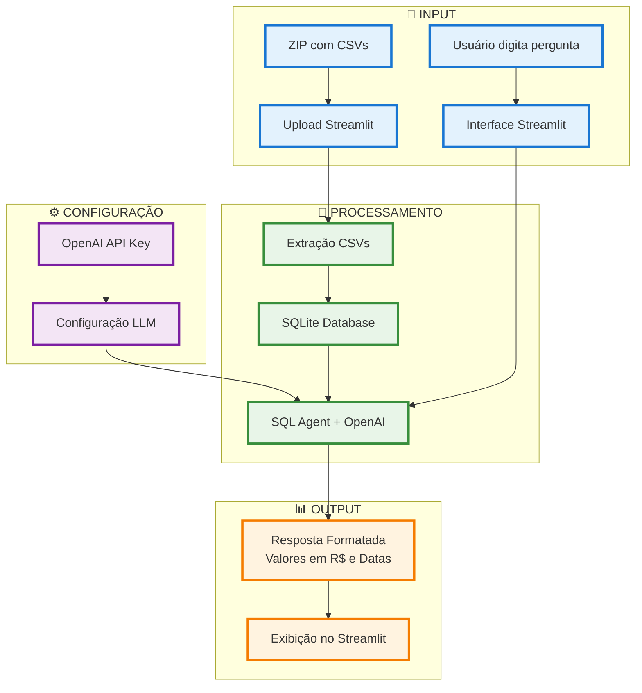

# 📊 Sistema de Análise de Notas Fiscais

Agente criado para o Desafio do curso de Agentes Autonomos com Redes Generativas da I2A2 Academy.

Sistema inteligente para análise de notas fiscais usando IA e processamento de linguagem natural.
## Regras do desafio
- Site do curso com o [desafio](https://sites.google.com/i2a2.academy/agentes-autonomos-com-ia-gen/atividade-obrigat%C3%B3ria-2025-06-18)

---
## 🏗️ Arquitetura do Sistema



## 🚀 Como Rodar o Agente localmente

### 📋 Pré-requisitos

- Python 3.8+
- OpenAI API Key
- Dados de notas fiscais em formato CSV ou arquivos .ZIP com dados em CSV.

### 🔧 Instalação

1. **Clone o repositório:**
```bash
git clone https://github.com/costadiogo/nf-agent.git
cd nf-agent
```

2. **Criar o ambiente virtual, não obrigatório:**
```bash
python -m venv seu_nome_de_preferência
```

3. **Ativar o ambiente virtual:**
```bash
windows: nf-agent\nome_do_ambiente_virtual\Scripts\activate

linux: source nome_do_ambiente_virtual/bin/activate
```

4. **Instale as dependências:**
```bash
pip install -r requirements.txt
```

### ⚡ Executando o Sistema

1. **Inicie o Streamlit:**
```bash
streamlit run app.py
```

2. **Acesse no navegador:**
```
http://localhost:8501
```

### 🔑 Configuração Inicial

1. **Configure sua OpenAI API Key:**
   - Na barra lateral esquerada, insira sua OpenAI API Key
   - A chave é necessária para o funcionamento do agente IA

2. **Prepare seus dados:**
   - Organize seus CSVs de notas fiscais
   - Compacte em um arquivo ZIP ou adicione aquivos .csv
   - Estrutura recomendada:
   
```
seu_aquivo.zip
├── arquivo_um.csv
└── aquivo_dois.csv

seu_arquivo.csv
```

### 💬 Como Usar

1. **Upload dos Dados:**
   - Na barra lateral arraste o aquivo .zip ou clique em Browse files
   - Faça upload do seu arquivo ZIP
   - Clique em "🔄 Processar Arquivo"

2. **Faça Perguntas:**
   - Vá para a aba "💬 Consultas"
   - Digite sua pergunta em português clique enter
   - Clique em "🔍 Consultar"

## ⚙️ Configurações Avançadas

### 🎛️ Parâmetros do LLM

No código, você pode ajustar:
- **Modelo**:  `gpt-4`
- **Temperature**: Controla criatividade (padrão: 0)
- **Agent Type**: `openai-tools` (recomendado)

### 🗄️ Banco de Dados

- **SQLite** temporário criado automaticamente
- Tabelas nomeadas automaticamente baseado nos CSVs
- Limpeza e sanitização automática dos dados

## 🔍 Funcionalidades

### ✅ O que o sistema faz:
- ✅ Processa múltiplos CSVs de uma vez
- ✅ Cria banco SQLite automaticamente
- ✅ Responde perguntas em linguagem natural
- ✅ Formata valores em Real (R$)
- ✅ Usa formato de data brasileiro (DD/MM/AAAA)
- ✅ Interface amigável com Streamlit
- ✅ Exemplos de consultas prontos

### 📊 Abas Disponíveis:
- **💬 Consultas**: Interface principal para perguntas
- **📋 Visão Geral**: Dados dos arquivos tranformados em tabelas carregadas na interface
- **📖 Exemplos**: Perguntas prontas por categoria

## 🛠️ Solução de Problemas

### ❌ Problemas Comuns:

**Erro de API Key:**
```
Verifique se sua OpenAI API Key está correta e ativa
```

**Erro no upload:**
```
Certifique-se que o arquivo é um ZIP contendo CSVs válidos
```

**Erro SQL:**
```
Verifique se os CSVs têm a estrutura correta
```

### 🔧 Debug Mode:

Para mais informações de debug, configure:
```python
verbose=True  # no create_sql_agent
```

## 📝 Contribuição

1. Fork o projeto
2. Crie sua branch a partir da dev (`git checkout -b feature/nova-funcionalidade`)
3. Commit suas mudanças (`git commit -m 'Adiciona nova funcionalidade'`)
4. Push para a branch (`git push origin feature/nova-funcionalidade`)
5. Abra um Pull Request

## 📄 Licença

Este projeto está licenciado sob a MIT License - veja o arquivo LICENSE para detalhes.

## 🤝 Suporte

Para dúvidas ou problemas:
- Abra uma issue no GitHub
- Consulte a documentação da [LangChain](https://python.langchain.com/)
- Verifique a documentação da [OpenAI](https://platform.openai.com/docs)
- Verifique a documentação do [Streamlit](https://docs.streamlit.io/)

---

**Desenvolvido usando Python, Streamlit, LangChain e OpenAI**
